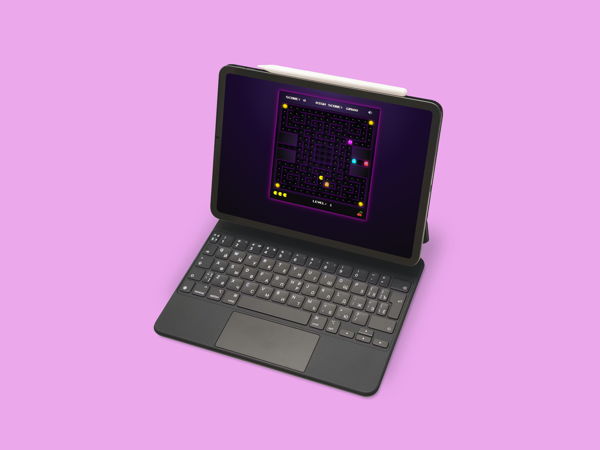

# Pac-Man Game 🎮

A classic Pac-Man arcade game recreation built with **React** and **TypeScript**, featuring authentic ghost AI, progressive difficulty, and retro gameplay mechanics.

[**🎮 Play Live Demo**](https://alena0490.github.io/Pacman/)



---

## 🎯 Features

### Gameplay

- **5 Progressive Levels** - Increasing difficulty with faster ghosts and shorter power-up durations
- **Authentic Ghost AI** - Four ghosts (Blinky, Pinky, Inky, Clyde) with unique personalities and behaviors
- **Power Pellets** - Turn the tables and chase frightened ghosts for bonus points
- **Bonus Fruits** - Collect level-specific fruits (cherry, strawberry, orange, apple, melon, galaxian)
- **Classic Coffee Break Cutscene** - Iconic intermission after level 2
- **Extra Lives** - Earn an extra life every 10,000 points
- **High Score Tracking** - Persistent high score saved in localStorage

### Ghost Behavior

- **Scatter/Chase Modes** - Ghosts alternate between patrolling corners and hunting Pac-Man
- **Cruise Elroy** - Blinky speeds up when few dots remain
- **Ghost House** - Progressive release system with bounce animations
- **Frightened Mode** - Blue ghosts flee when Pac-Man eats a power pellet
- **Eyes Return** - Eaten ghosts return to the ghost house for regeneration

### Technical Features

- **Responsive Design** - Adapts to different screen sizes
- **Keyboard Controls** - Arrow keys for movement
- **Sound Effects** - Authentic arcade sounds including waka-waka, sirens, and frightened mode music
- **Mute Toggle** - Control sound on/off
- **Accessibility** - Screen reader announcements and semantic HTML
- **Pixel-Perfect Graphics** - Custom SVG animations for Pac-Man and ghosts

---

## 🛠️ Technologies

- **React 18** - UI framework
- **TypeScript** - Type-safe development
- **Vite** - Build tool and dev server
- **CSS3** - Styling and animations
- **SVG** - Custom animated graphics
- **GitHub Pages** - Deployment

---

## 🎮 How to Play

1. **Start the Game** - Click "Start Game"
2. **Move Pac-Man** - Use arrow keys (↑ ↓ ← →)
3. **Collect Dots** - Eat all dots to advance to the next level
4. **Avoid Ghosts** - Red, Pink, Cyan, and Orange ghosts will chase you
5. **Eat Power Pellets** - Large dots turn ghosts blue and vulnerable
6. **Chase Ghosts** - Eat blue ghosts for bonus points (200, 400, 800, 1600)
7. **Collect Fruits** - Bonus fruits appear at 70 and 170 dots eaten
8. **Complete 5 Levels** - Beat all levels to win!

---

## 📦 Installation & Setup

### Prerequisites

- Node.js (v16 or higher)
- npm or yarn

### Local Development

```bash
# Clone the repository
git clone https://github.com/alena0490/Pacman.git

# Navigate to project directory
cd Pacman

# Install dependencies
npm install

# Start development server
npm run dev

# Open browser to http://localhost:5173
```

### Build for Production

```bash
# Create optimized production build
npm run build

# Preview production build locally
npm run preview
```

### Deploy to GitHub Pages

```bash
# Deploy to gh-pages branch
npm run deploy
```

---

## 🎨 Game Mechanics

### Scoring

- **Dot**: 10 points
- **Power Pellet**: 50 points
- **Ghost** (1st/2nd/3rd/4th in sequence): 200/400/800/1600 points
- **Fruits**: 100-5000 points (level-dependent)

### Level Progression

- **Level 1-2**: Cherry & Strawberry (slower ghosts, 8s frightened)
- **Level 3-4**: Orange (medium speed, 6s frightened)
- **Level 5**: Apple (fast ghosts, 3s frightened)

### Ghost AI Personalities

- **Blinky (Red)**: Directly chases Pac-Man, speeds up with Cruise Elroy
- **Pinky (Pink)**: Targets position ahead of Pac-Man
- **Inky (Cyan)**: Unpredictable, uses Blinky's position in calculations
- **Clyde (Orange)**: Chases when far, retreats when close

---

## 📁 Project Structure

``` Pacman/
├── public/
│   ├── sounds/          # Audio files
│   ├── img/             # Game images
│   └── fonts/           # Custom fonts
├── src/
│   ├── components/      # React components
│   │   ├── GameField.tsx
│   │   ├── CoffeeBreak.tsx
│   │   ├── StartScreen.tsx
│   │   ├── GameOver.tsx
│   │   └── WinScreen.tsx
│   ├── svg/             # SVG components
│   │   ├── AnimatedPacman.tsx
│   │   └── AnimatedGhosts.tsx
│   ├── hooks/           # Custom hooks
│   │   ├── useSound.ts
│   │   └── useGhostBehavior.tsx
│   ├── utils/           # Utility functions
│   │   └── ghostAI.ts
│   ├── data/            # Game data & constants
│   │   ├── mazeData.ts
│   │   ├── gameConstants.ts
│   │   └── FruitTypes.ts
│   ├── App.tsx          # Main game logic
│   └── index.css        # Global styles
└── vite.config.ts       # Vite configuration
```

---

## 🎵 Credits

### Sounds

- Original Pac-Man arcade sounds from [Voicy Network](https://www.voicy.network/)

### Fonts

- **Crackman** - Retro arcade font
- **Emulogic** - Classic game font

### Inspiration

- Original Pac-Man (1980) by Namco

---

## 📝 License

This project is open source and available for educational purposes. Pac-Man is a registered trademark of Bandai Namco Entertainment Inc.

---

## 👩‍💻 Author

Alena Pumprová

- GitHub: [@alena0490](https://github.com/Alena0490)
- LinkedIn: [Alena Pumprová](https://www.linkedin.com/in/alena-pumprova/)

---

## 🚀 Future Enhancements

- [ ] Add touch controls for mobile devices
- [ ] Implement waiting period for ghost regeneration
- [ ] Add more levels beyond level 5
- [ ] Create additional coffee break cutscenes
- [ ] Add difficulty settings

---

*Enjoy the game! 👾
